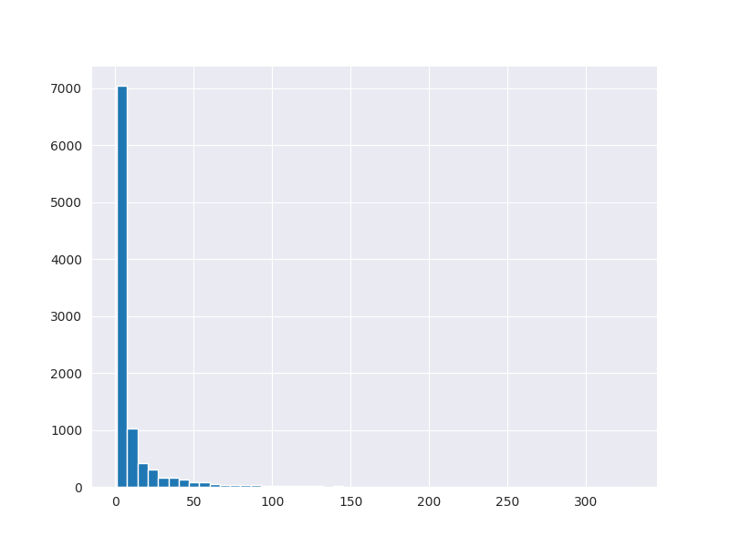
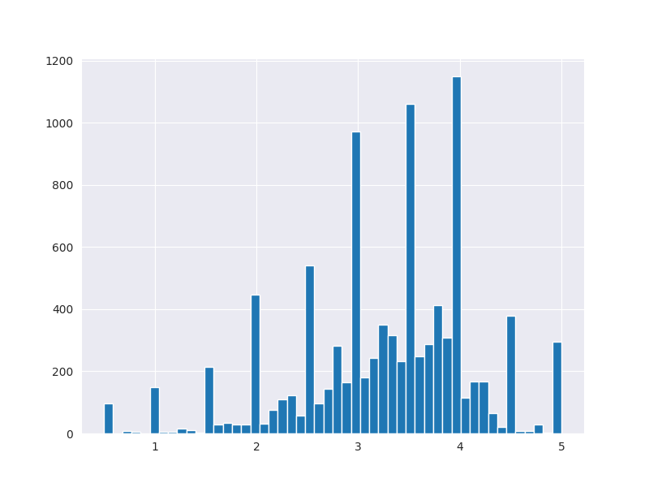
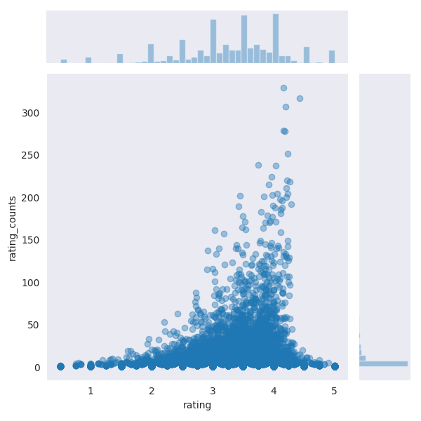

# About this project
* To understand recommender system I followed the tutorial from "https://stackabuse.com/creating-a-simple-recommender-system-in-python-using-pandas"
* Database used for this tuto coming from "https://grouplens.org/datasets/movielens/"
* For this project I will use the small one to ease data processing "http://files.grouplens.org/datasets/movielens/ml-latest-small.zip"


# Step by Step
### 1- Reading data containing movie ratings
```python
ratings_data = pd.read_csv("ratings_small.csv")
print('--- Reading data containing movie ratings ---')
print(ratings_data.head())
print('----------------------\n\n')
```
```console
--- Reading data containing movie ratings ---
    userId  movieId  rating  timestamp
0        1        1     4.0  964982703
1        1        3     4.0  964981247
2        1        6     4.0  964982224
3        1       47     5.0  964983815
4        1       50     5.0  964982931
----------------------
```

### 2- Reading data containing movie titles and genres
```python
movie_names = pd.read_csv("movies_small.csv")
print('--- Reading data containing movie titles and genres ---')
print(movie_names.head())
print('----------------------\n\n')
```
```console
--- Reading data containing movie titles and genres ---
   movieId                               title                                       genres
0        1                    Toy Story (1995)  Adventure|Animation|Children|Comedy|Fantasy
1        2                      Jumanji (1995)                   Adventure|Children|Fantasy
2        3             Grumpier Old Men (1995)                               Comedy|Romance
3        4            Waiting to Exhale (1995)                         Comedy|Drama|Romance
4        5  Father of the Bride Part II (1995)                                       Comedy
----------------------
```

### 3- Merging both dataset into one dataframe using "movieId" column as reference
```python
movie_data = pd.merge(ratings_data, movie_names, on='movieId')
print('--- Merged data ---')
print(movie_data.head())
print('----------------------\n\n')
```
```console
--- Merged data ---
   userId  movieId  rating   timestamp             title                                       genres
0       1        1     4.0   964982703  Toy Story (1995)  Adventure|Animation|Children|Comedy|Fantasy
1       5        1     4.0   847434962  Toy Story (1995)  Adventure|Animation|Children|Comedy|Fantasy
2       7        1     4.5  1106635946  Toy Story (1995)  Adventure|Animation|Children|Comedy|Fantasy
3      15        1     2.5  1510577970  Toy Story (1995)  Adventure|Animation|Children|Comedy|Fantasy
4      17        1     4.5  1305696483  Toy Story (1995)  Adventure|Animation|Children|Comedy|Fantasy
----------------------
```

### 4- Grouping merged data by movie "title" and calculating the mean for "rating" for each movie title
```python
movie_data.groupby('title')['rating'].mean().head()
print('--- Grouped by title and mean ---')
print(movie_data.groupby('title')['rating'].mean().head())
print('----------------------\n\n')
```
```console
--- Grouped by title and mean ---
title
'71 (2014)                                 4.0
'Hellboy': The Seeds of Creation (2004)    4.0
'Round Midnight (1986)                     3.5
'Salem's Lot (2004)                        5.0
'Til There Was You (1997)                  4.0
Name: rating, dtype: float64
----------------------
```

### 5- Sorting previous data highest to lowest mean for each movie
```python
movie_data.groupby('title')['rating'].mean().sort_values(ascending=False).head()
print('--- Sorting previous data highest to lowest mean for each movie ---')
print(movie_data.groupby('title')['rating'].mean().sort_values(ascending=False).head())
print('----------------------\n\n')
```
```console
--- Sorting previous data highest to lowest mean for each movie ---
title
Karlson Returns (1970)                           5.0
Winter in Prostokvashino (1984)                  5.0
My Love (2006)                                   5.0
Sorority House Massacre II (1990)                5.0
Winnie the Pooh and the Day of Concern (1972)    5.0
Name: rating, dtype: float64
----------------------
```

### 6- Counting number of ratings for each movie and sorting it highest to lowest
```python
movie_data.groupby('title')['rating'].count().sort_values(ascending=False).head()
print('--- Counting number of ratings for each movie and sorting it highest to lowest ---')
print(movie_data.groupby('title')['rating'].count().sort_values(ascending=False).head())
print('----------------------\n\n')
```
```console
--- Counting number of ratings for each movie and sorting it highest to lowest ---
title
Forrest Gump (1994)                 329
Shawshank Redemption, The (1994)    317
Pulp Fiction (1994)                 307
Silence of the Lambs, The (1991)    279
Matrix, The (1999)                  278
Name: rating, dtype: int64
# ----------------------
```

### 7.1- Getting mean for each movie
```python
ratings_mean_count = pd.DataFrame(movie_data.groupby('title')['rating'].mean())
```
#### 7.2- Adding new column "rating_counts" to get number of user who added a rating for each movie
```python
ratings_mean_count['rating_counts'] = pd.DataFrame(movie_data.groupby('title')['rating'].count())
print('--- ratings_mean_count.head() ---')
print(ratings_mean_count.head())
print('----------------------\n\n')
```
```console
--- ratings_mean_count.head() ---
                                         rating  rating_counts
title
'71 (2014)                                  4.0              1
'Hellboy': The Seeds of Creation (2004)     4.0              1
'Round Midnight (1986)                      3.5              2
'Salem's Lot (2004)                         5.0              1
'Til There Was You (1997)                   4.0              2
----------------------
```

### 8- Plotting histogram for the number of ratings represented by the "rating_counts" column
```python
plt.figure(figsize=(8,6))
plt.rcParams['patch.force_edgecolor'] = True
ratings_mean_count['rating_counts'].hist(bins=50)
plt.savefig('plots/histogram_nb_ratings_by_rating_counts.png')
```


### 9- Plotting histogram for average ratings
```python
plt.figure(figsize=(8,6))
plt.rcParams['patch.force_edgecolor'] = True
ratings_mean_count['rating'].hist(bins=50)
plt.savefig('plots/histogram_avg_ratings.png')
```


### 10- Plotting average ratings against the number of ratings
```python
plt.figure(figsize=(8,6))
plt.rcParams['patch.force_edgecolor'] = True
sns.jointplot(x='rating', y='rating_counts', data=ratings_mean_count, alpha=0.4)
plt.savefig('plots/seaborn_avg_ratings_vs_nb_ratings.png')
```


### 11- Finding Similarities Between Movies: we will have rating by user for each movie
```python
user_movie_rating = movie_data.pivot_table(index='userId', columns='title', values='rating')
print('--- user_movie_rating.head() ---')
print(user_movie_rating.head())
print('----------------------\n\n')
```
```console
--- user_movie_rating.head() ---
title   '71 (2014)  'Hellboy': The Seeds of Creation (2004)  'Round Midnight (1986)  'Salem's Lot (2004)  ...  xXx (2002)  xXx: State of the Union (2005)  ¡Three Amigos! (1986)  À nous la liberté (Freedom for Us) (1931)
userId                                                                                                    ...
1              NaN                                      NaN                     NaN                  NaN  ...         NaN                             NaN                    4.0
NaN
2              NaN                                      NaN                     NaN                  NaN  ...         NaN                             NaN                    NaN
NaN
3              NaN                                      NaN                     NaN                  NaN  ...         NaN                             NaN                    NaN
NaN
4              NaN                                      NaN                     NaN                  NaN  ...         NaN                             NaN                    NaN
NaN
5              NaN                                      NaN                     NaN                  NaN  ...         NaN                             NaN                    NaN
NaN
[5 rows x 9719 columns]
----------------------
```

### 12- Finding the user ratings for "Forrest Gump (1994)"
```python
forrest_gump_ratings = user_movie_rating['Forrest Gump (1994)']
print('--- forrest_gump_ratings.head() ---')
print(forrest_gump_ratings.head())
print('----------------------\n\n')
```
```console
--- forrest_gump_ratings.head() ---
userId
1    4.0
2    NaN
3    NaN
4    NaN
5    NaN
# Name: Forrest Gump (1994), dtype: float64
# ----------------------
```

### 13.1- Finding all movies having similarities with "Forrest Gump (1994)" 
```python
movies_like_forest_gump = user_movie_rating.corrwith(forrest_gump_ratings)
```
### 13.2- Adding new column "Correlation" with correlation score
```python
corr_forrest_gump = pd.DataFrame(movies_like_forest_gump, columns=['Correlation'])
```
### 13.3 Dropping all NA in dataframe
```python
corr_forrest_gump.dropna(inplace=True)
print('--- corr_forrest_gump.head() ---')
print(corr_forrest_gump.head())
print('----------------------\n\n')
```
```console
--- corr_forrest_gump.head() ---
                                Correlation
title
'burbs, The (1989)                 0.197712
(500) Days of Summer (2009)        0.234095
*batteries not included (1987)     0.892710
...And Justice for All (1979)      0.928571
10 Cent Pistol (2015)             -1.000000
----------------------
```

### 14- Sorting previous dataset
```python
corr_forrest_gump.sort_values('Correlation', ascending=False).head(10)
print('--- corr_forrest_gump.sort_values(Correlation, ascending=False).head(10) ---')
print(corr_forrest_gump.sort_values('Correlation', ascending=False).head(10))
print('----------------------\n\n')
```
```console
--- corr_forrest_gump.sort_values(Correlation, ascending=False).head(10) ---
                                           Correlation
title
Lost & Found (1999)                                1.0
Century of the Self, The (2002)                    1.0
The 5th Wave (2016)                                1.0
Play Time (a.k.a. Playtime) (1967)                 1.0
Memories (Memorîzu) (1995)                         1.0
Playing God (1997)                                 1.0
Killers (2010)                                     1.0
Girl Walks Home Alone at Night, A (2014)           1.0
Tampopo (1985)                                     1.0
Cercle Rouge, Le (Red Circle, The) (1970)          1.0
----------------------
```

### 15- Joining previous dataset with rating counts
```python
corr_forrest_gump = corr_forrest_gump.join(ratings_mean_count['rating_counts'])
corr_forrest_gump.head()
print('--- corr_forrest_gump.head() ---')
print(corr_forrest_gump.head())
print('----------------------\n\n')
```
```console
--- corr_forrest_gump.head() ---
                                Correlation  rating_counts
title
'burbs, The (1989)                 0.197712             17
(500) Days of Summer (2009)        0.234095             42
*batteries not included (1987)     0.892710              7
...And Justice for All (1979)      0.928571              3
10 Cent Pistol (2015)             -1.000000              2
----------------------
```

### 16- Sorting previous dataframe to get most relevant movies to less ones with limiting rating_counts at 50
```python
corr_forrest_gump[corr_forrest_gump ['rating_counts']>50].sort_values('Correlation', ascending=False).head()
print('--- corr_forrest_gump[corr_forrest_gump [rating_counts]>50].sort_values(Correlation, ascending=False).head() ---')
print(corr_forrest_gump[corr_forrest_gump ['rating_counts']>50].sort_values('Correlation', ascending=False).head())
print('----------------------\n\n')
```
```console
--- corr_forrest_gump[corr_forrest_gump [rating_counts]>50].sort_values(Correlation, ascending=False).head() ---
                           Correlation  rating_counts
title
Forrest Gump (1994)           1.000000            329
Mr. Holland's Opus (1995)     0.652144             80
Pocahontas (1995)             0.550118             68
Grumpier Old Men (1995)       0.534682             52
Caddyshack (1980)             0.520328             52
----------------------
```